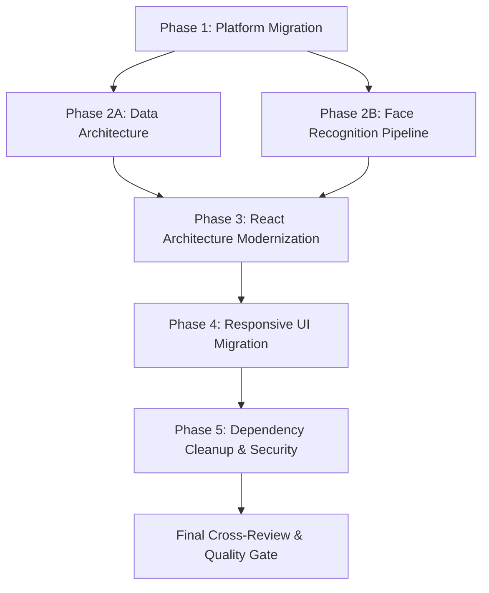

# 04 - Comprehensive Migration Plan & Multi-Agent Roadmap

**Orchestrator:** Technical Lead & Primary Orchestrator  
**Date:** 2026-08-20  
**Repository Root:** `D:\StudyProjects\ReactJsProject\carpark`

---

## 1. Principles & Safety Rules

1. **Brownfield Preservation:** Preserve working application behavior and exact API contracts while modernizing architecture.
2. **Mandatory Multi-Agent Reviews:** No agent may approve its own work (`IMPLEMENT → REVIEW → FIX → RE-REVIEW → ACCEPT`).
3. **No Blind Deletions / Upgrades:** Retain `face-api.js` and model assets in `public/models/`.
4. **Build Gates:** Every major phase must conclude with clean `pnpm build` and verification.

---

## 2. Phase Breakdown & File Ownership

### Phase 1 — Platform Migration
- **Lead Agent:** `platform-engineer` (`platform-migrator`)
- **Reviewers:** `react-architect` & `project-auditor` (2 independent reviewers)
- **Scope & Files:**
  - `package.json` (Add Vite 6, `@vitejs/plugin-react`, configure scripts `dev`, `build`, `preview`, `lint`)
  - `vite.config.js` (Root config, alias `@/` -> `/src`, static assets config)
  - `index.html` (Move from `public/index.html` to root `/index.html`, point to ``)
  - `.env.example`, `.env` (Public client environment variables: `VITE_API_BASE_URL`, `VITE_API_MODE`, etc.)
  - `src/main.jsx` (Modern entrypoint replacing `src/index.js`)
  - Tailwind v4 setup in `src/index.css`
  - Normalization of lockfiles (remove `package-lock.json` and `yarn.lock`, keep `pnpm-lock.yaml`)
- **Build Gate:** `pnpm install`, `pnpm build`

---

### Phase 2A — Data Architecture & Query Modernization
- **Lead Agent:** `data-engineer` (`data-architect`)
- **Reviewers:** `react-architect` & `project-auditor`
- **Scope & Files:**
  - `src/shared/api/axiosClient.js` (Unified Axios instance with request/response interceptors for token handling & environment base URL)
  - `src/shared/api/endpoints.js` (Clean typed endpoint constants)
  - `src/shared/api/mock/` (Contract-preserving HTTP mock handlers for offline/test mode & Plate Recognizer fallback)
  - `src/shared/providers/QueryProvider.jsx` (TanStack Query client configuration with sensible `staleTime`, deduplication, and retry policies)
  - `src/features/*/api/` & `src/features/*/queries/` (Domain-specific hooks for parking, bookings, subscriptions, vehicles, reviews, reports, auth)
- **Build Gate:** `pnpm build`

---

### Phase 2B — Face Recognition Pipeline Modernization
- **Lead Agent:** `face-recognition-engineer` (`face-recognition-auditor`)
- **Reviewers:** `data-engineer` & `react-architect`
- **Scope & Files:**
  - `src/features/face-recognition/services/faceModelLoader.js` (Singleton promise-cached model loader)
  - `src/features/face-recognition/hooks/useFaceDetection.js` (Webcam lifecycle, memory leak prevention, track cleanup on unmount)
  - `src/features/face-recognition/components/WebcamCapture.jsx` (Refactored UI component with visual status, direct ref capture, no DOM query)
  - Integration with `Register`, `Login`, and `Staff` features
- **Build Gate:** `pnpm build`, verify `/models/*` URL resolution

---

### Phase 3 — React Architecture & Component Modernization
- **Lead Agent:** `react-architect` (`react-refactor`)
- **Reviewers:** `data-engineer`, `face-recognition-engineer`, `project-auditor`
- **Scope & Files:**
  - Structure reorganization into feature-oriented architecture:
    - `src/features/auth/` (Login, Register, AuthContext / AuthStore)
    - `src/features/parking/` (ParkingLots, ParkingSpots, SpotModal)
    - `src/features/booking/` (BookingForm, BookingHistory)
    - `src/features/subscription/` (SubscriptionRegister, Renewal, SubscriptionHistory)
    - `src/features/vehicles/` (VehicleList, VehicleForm - **Fix infinite re-render loop**)
    - `src/features/profile/` (PersonalInfo, HistoryTabs)
    - `src/features/reviews/` (ReviewList, ReviewForm, StarRating)
    - `src/features/admin/` (ReportCharts, RevenueStats)
    - `src/features/staff/` (StaffCheckIn, StaffCheckOut, PlateReader)
  - Application of Vercel React Best Practices:
    - Eliminate derived-state effects in `Header` (`rerender-derived-state-no-effect`)
    - Hoist static JSX / styles (`rendering-hoist-jsx`)
    - Object URL cleanup on unmount (`rerender-use-ref-transient-values`)
    - Syntax bug fix in `App.jsx`
- **Output Report:** `.agents/artifacts/05-REACT-REVIEW.md`
- **Build Gate:** `pnpm build`

---

### Phase 4 — Responsive UI & Tailwind Migration
- **Lead Agent:** `responsive-ui-engineer` (`ui-responsive`)
- **Reviewers:** `react-architect` & `quality-gate`
- **Scope & Files:**
  - Modern design tokens, color palette (preserving green/blue brand identity: emerald/teal/slate), glassmorphism, smooth gradients
  - Mobile-first responsive navigation with mobile drawer/hamburger menu
  - Responsive tables with horizontal scroll containers / responsive cards for mobile viewports (360px, 390px, 768px, 1024px, 1280px, 1920px)
  - Premium UI components: Modals, Loading Skeletons, Toasts, Form inputs, Action buttons
- **Output Report:** `.agents/artifacts/06-UI-REVIEW.md`
- **Build Gate:** `pnpm build`

---

### Phase 5 — Dependency & Security Hardening
- **Lead Agent:** `dependency-security`
- **Reviewers:** `project-auditor` & `quality-gate`
- **Scope & Files:**
  - Remove deprecated `react-cookies`, `react-cookie`, `react-scripts`, `localforage`, `lucide`, `web-vitals`
  - Remove stale `package-lock.json` and `yarn.lock`
  - Run `pnpm audit` and resolve vulnerabilities
  - Verify `.env.example` does not contain exposed secrets
- **Build Gate:** `pnpm install`, `pnpm build`

---

### Final Cross-Agent Review & Quality Gate
- **Reviewers:** `quality-gate` + `react-architect` + `data-engineer` + `face-recognition-engineer` + `responsive-ui-engineer`
- **Outputs:**
  - `.agents/artifacts/07-CROSS-REVIEW.md` (Detailed cross-agent inspection & sign-off)
  - `.agents/artifacts/99-FINAL-AUDIT.md` (Final verdict: PASS)
